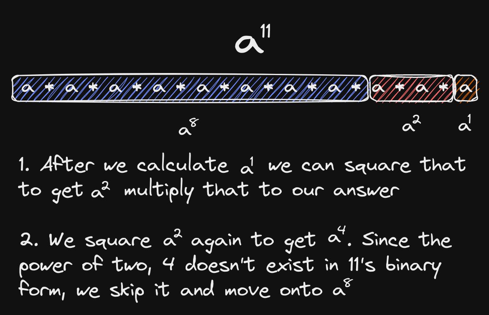

# Binary Exponentiation

Binary exponentiation is a technique for calculating a number $a^b\mod{m}$ in $O(\log_2{b})$ time.

## Applications

Binary exponentiation has a number of applications:

- Large number computations without overflow
- Applying Fermat's Little Theorem to compute modular division
- Usage in combinatorics problems

## How it Works

Binary Exponentiation works by the Divide & Conquer approach. It takes advantage of bitwise operators to divide the exponent into powers of 2. Now, we have only $\log_2{b}$ of exponentiation we have to work with. We can make use of the smaller segments to calculate the value of larger segments, because each larger segment is just the previous segment squared:

Since we have to calculate the $\log_2{b}$ segments, the time complexity is $O(\log_2{b})$, and the space complexity is $O(1)$, because we just need to store a few numbers. Since we are simply multiplying, we can continuously modulus our variables by the given modulus number. For modulus numbers $\gt10^9$, we have to use modular multiplication instead of regular multiplication, to prevent edge case overflow.

## Snippet

At [`binpow.cpp`](./binpow.cpp), you can find my implementation of binary exponentiation.
