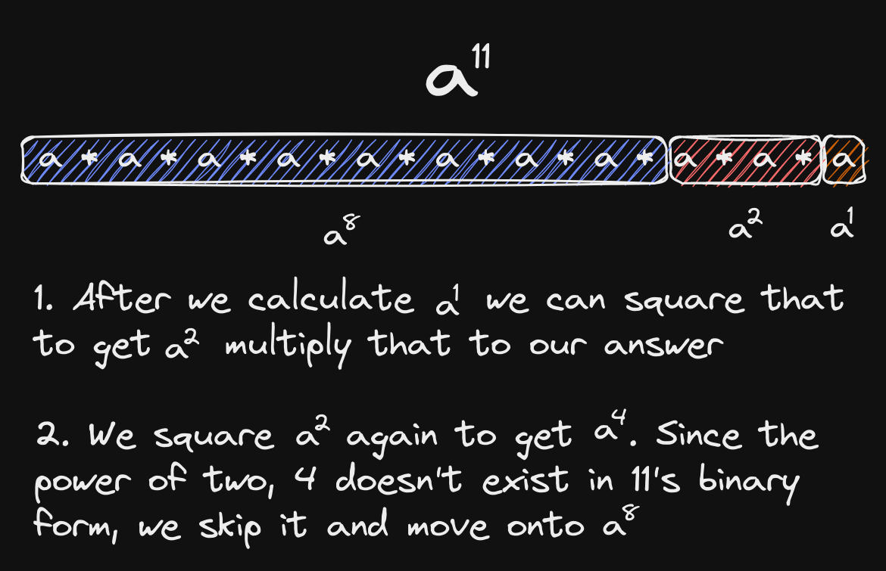

# Binary Exponentiation

Binary exponentiation is a technique for calculating a number $a^b\mod{m}$ in $O(\log_2{b})$ time.

## Applications

Binary exponentiation has a number of applications:

- Large number computations without overflow
- Applying Fermat's Little Theorem to compute modular division
- Usage in combinatorics problems

## How it Works

Binary Exponentiation works by the Divide & Conquer approach. It takes advantage of bitwise operators to divide the exponent into powers of 2. Now, we have only $\log_2{b}$ of exponentiation we have to work with. We can make use of the smaller segments to calculate the value of larger segments, because each larger segment is just the previous segment squared:



Since we have to calculate the $\log_2{b}$ segments, the time complexity is $O(\log_2{b})$, and the space complexity is $O(1)$, because we just need to store a few numbers. Since we are simply multiplying, we can continuously modulus our variables by the given modulus number. For modulus numbers $\ge2^32$, we have to use modular multiplication instead of regular multiplication, to prevent edge case overflow.

## Snippet

At [`binpow.cpp`](./binpow.cpp), you can find my implementation of binary exponentiation.

## Fermat's Little Theorem

Fermat's Little Theorem is a theorem for working with modular division. It states that if we aer working with $\mod p$ where $p$ is a prime number, there exists for each $a$ that is a part of $\mod p$, an inverse $a^-1$ such that $a\cdot a^{-1}\equiv 1\pmod{p}$, where $a^{-1}\equiv a^{p-2}\pmod{p}$. This can be useful for example when evaluating the combinatorics formula $\mod p$, because we can simply calculate the numerator $\mod p$ and then multiply that by the inverse of the denominator $\mod p$. That will give us the equivalent of calculating the whole thing $\mod p$. Binary exponentiation comes in handy in this case because $p$ can be very large, and we can use binary exponentiation to calculate the exponent efficiently.

## Precomputing faster

Sometimes we are told to precompute the modular inverse of some geometric sequence of numbers. Some examples include:

- Precomputed factorial array
- Precomputed powers for rolling string hash

When calculating a large number of modular inverses, binary exponentiation can be proven slow because of the logarithmic factor. In such cases we can instead calculate the modular inverse of the last number in the sequence, and then iterate backwards and multiply the inverse by the current number. This will work because when we multiply the inverse by the current number, we are essentially canceling out that number from the denominator. For example, let's say we want to calculate the modular inverses of the factorials:

```cpp
vector<int> inv(n);
// Calculate inverse of (n-1)!
inv[n - 1] = binpow(fact[n - 1], MOD - 2, MOD);
for (int i{n - 2}; i >= 0; --i) {
  // 1 / (i!) = 1 / (i + 1)! * (i + 1)
  inv[i] = (inv[i + 1] * (i + 1)) % MOD;
}
```
